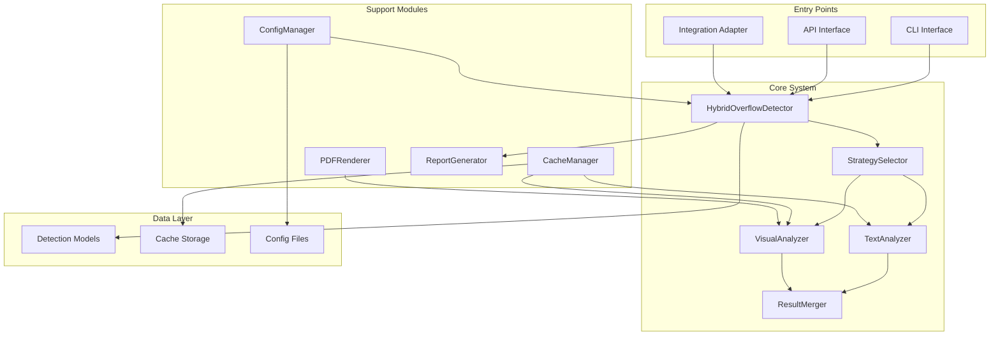

# AI向け設計書：ハイブリッドはみ出し検出システム
## 詳細設計と実装ガイド

### 🎨 システムアーキテクチャ設計



### 📁 詳細なディレクトリ構造

```bash
overflow_detection/
├── __init__.py                    # パッケージ初期化
├── __version__.py                 # バージョン情報
├── cli.py                        # コマンドラインインターフェース
├── api.py                        # API エンドポイント
│
├── core/                         # コア機能
│   ├── __init__.py
│   ├── detector.py               # HybridOverflowDetector メインクラス
│   ├── strategies.py             # 検出戦略の実装
│   ├── text_analyzer.py          # テキストベース解析
│   ├── visual_analyzer.py        # 視覚ベース解析
│   └── result_merger.py          # 結果統合ロジック
│
├── models/                       # データモデル
│   ├── __init__.py
│   ├── detection.py              # 検出結果モデル
│   ├── config.py                 # 設定モデル
│   └── exceptions.py             # カスタム例外
│
├── utils/                        # ユーティリティ
│   ├── __init__.py
│   ├── pdf_renderer.py           # PDF→画像変換
│   ├── cache_manager.py          # キャッシュ管理
│   ├── performance.py            # パフォーマンス計測
│   └── validators.py             # 入力検証
│
├── reporting/                    # レポート生成
│   ├── __init__.py
│   ├── markdown_reporter.py      # Markdown形式
│   ├── html_reporter.py          # HTML形式
│   └── json_reporter.py          # JSON形式
│
├── integration/                  # 既存システム統合
│   ├── __init__.py
│   ├── adapter.py                # 統合アダプター
│   └── hooks.py                  # フック機能
│
├── config/                       # 設定ファイル
│   ├── default.yaml              # デフォルト設定
│   └── schema.yaml               # 設定スキーマ
│
└── tests/                        # テスト
    ├── __init__.py
    ├── conftest.py               # pytest設定
    ├── test_core/                # コアテスト
    ├── test_utils/               # ユーティリティテスト
    └── fixtures/                 # テストデータ
```

### 🔧 クラス設計詳細

#### メイン検出器クラス
```python
# core/detector.py
from typing import Optional, List, Dict, Callable
from pathlib import Path
import logging
from concurrent.futures import ProcessPoolExecutor
from ..models.detection import DetectionResult, DetectionConfig
from ..models.exceptions import OverflowDetectionError
from .strategies import DetectionStrategy, AdaptiveStrategy

class HybridOverflowDetector:
    """
    AI実装指示:
    1. __init__で設定を読み込み、各コンポーネントを初期化
    2. 公開メソッドはすべてエラーハンドリングでラップ
    3. 内部状態は最小限に保つ（ステートレス設計）
    4. ログは構造化（JSON形式）で出力
    """
    
    def __init__(self, config_path: Optional[Path] = None):
        """
        初期化処理
        
        Args:
            config_path: 設定ファイルパス（Noneの場合はデフォルト）
            
        Implementation notes for AI:
        - ConfigManagerを使って設定を読み込む
        - 各アナライザーのインスタンスを作成
        - キャッシュマネージャーを初期化
        - ロガーを設定
        """
        self.logger = self._setup_logger()
        self.config = self._load_config(config_path)
        self.strategy = self._create_strategy()
        self.cache = self._setup_cache()
        
    def detect_file(
        self,
        pdf_path: Path,
        strategy: Optional[str] = None,
        progress_callback: Optional[Callable[[int, int], None]] = None
    ) -> DetectionResult:
        """
        単一PDFファイルのはみ出し検出
        
        Args:
            pdf_path: PDFファイルパス
            strategy: 検出戦略（省略時は設定値を使用）
            progress_callback: 進捗コールバック(current_page, total_pages)
            
        Returns:
            DetectionResult: 検出結果
            
        Implementation notes for AI:
        - ファイルの存在確認
        - キャッシュチェック
        - ページごとに検出実行
        - 進捗通知
        - 結果の集約
        """
        
    def detect_batch(
        self,
        pdf_paths: List[Path],
        parallel: bool = True,
        max_workers: Optional[int] = None
    ) -> List[DetectionResult]:
        """
        複数PDFファイルの一括検出
        
        Implementation notes for AI:
        - ProcessPoolExecutorで並列処理
        - メモリ使用量を監視
        - エラーが発生してもほかのファイルは処理継続
        """
        
    @staticmethod
    def _safe_execute(func: Callable) -> Callable:
        """
        エラーハンドリングデコレータ
        
        Implementation notes for AI:
        - すべての例外をキャッチ
        - エラーをログに記録
        - 適切なデフォルト値を返す
        """
```

#### テキストアナライザー設計
```python
# core/text_analyzer.py
import pdfplumber
from typing import List, Tuple, Dict, Optional
import numpy as np
from ..models.detection import CodeBlock, OverflowInfo

class TextAnalyzer:
    """
    テキストベースのはみ出し検出
    
    AI実装指示:
    1. 日本語文字幅の正確な計算
    2. 行の自動認識（Y座標でグループ化）
    3. 0.1pt精度での検出
    4. エラー時は部分的な結果でも返す
    """
    
    def analyze_page(self, page: pdfplumber.page.Page) -> List[OverflowInfo]:
        """
        ページ内のはみ出しを検出
        
        Implementation flow for AI:
        1. コードブロックを検出
        2. 各ブロック内の文字情報を取得
        3. 行ごとにグループ化
        4. 各行の最右端文字位置を確認
        5. はみ出し幅を計算
        """
        
    def _detect_code_blocks(self, page: pdfplumber.page.Page) -> List[CodeBlock]:
        """
        コードブロックの検出
        
        Implementation notes for AI:
        - 背景色（グレー）で識別
        - テキストパターンでフォールバック
        - $ で始まる行
        - 連続したインデント
        """
        
    def _group_chars_by_line(
        self, 
        chars: List[Dict],
        tolerance: float = 3.0
    ) -> Dict[int, List[Dict]]:
        """
        文字を行ごとにグループ化
        
        Algorithm for AI:
        1. Y座標でソート
        2. 隣接する文字のY座標差がtolerance以内なら同一行
        3. 行番号をキーとした辞書を返す
        """
        
    def _calculate_overflow(
        self,
        line_chars: List[Dict],
        block_bbox: Tuple[float, float, float, float]
    ) -> Optional[float]:
        """
        はみ出し幅の計算
        
        Precision notes for AI:
        - 小数点第1位まで計算
        - 0.1pt未満は0として扱う
        - 右端文字のx1座標 - ブロックのx1座標
        """
```

#### 視覚アナライザー設計
```python
# core/visual_analyzer.py
import fitz  # PyMuPDF
import cv2
import numpy as np
from PIL import Image
from typing import List, Tuple, Optional
from ..models.detection import OverflowInfo

class VisualAnalyzer:
    """
    視覚ベースのはみ出し検出
    
    AI実装指示:
    1. 300DPIでレンダリング
    2. エッジ検出で文字境界を特定
    3. メモリ効率を考慮（ページごとに解放）
    4. OpenCVの最適なパラメータを使用
    """
    
    def __init__(self, dpi: int = 300):
        """
        初期化
        
        Args:
            dpi: レンダリング解像度
            
        Implementation notes for AI:
        - DPIは設定可能だが、デフォルト300を推奨
        - スケール係数を事前計算（dpi/72）
        """
        self.dpi = dpi
        self.scale = dpi / 72.0
        
    def analyze_page(
        self,
        pdf_path: str,
        page_num: int,
        code_blocks: List[CodeBlock]
    ) -> List[OverflowInfo]:
        """
        ページの視覚的解析
        
        Implementation flow for AI:
        1. ページをレンダリング
        2. 各コードブロック領域を抽出
        3. エッジ検出
        4. 行ごとにはみ出しを検出
        5. ピクセル→pt変換
        """
        
    def _render_page(self, pdf_path: str, page_num: int) -> np.ndarray:
        """
        PDFページを画像にレンダリング
        
        Memory management for AI:
        - fitz.Document はwith文で管理
        - ピクセルマップは即座に画像に変換
        - 不要なオブジェクトは明示的に削除
        """
        
    def _detect_edges(self, image: np.ndarray) -> np.ndarray:
        """
        エッジ検出
        
        OpenCV parameters for AI:
        - Gaussian blur: kernel=(3,3), sigmaX=1.0
        - Canny: low=50, high=150
        - 必要に応じて適応的二値化も使用
        """
        
    def _analyze_line_overflow(
        self,
        line_region: np.ndarray,
        margin_region: np.ndarray
    ) -> Optional[float]:
        """
        行のはみ出し解析
        
        Algorithm for AI:
        1. 行領域の右端エッジを検出
        2. マージン領域のテキストピクセルを確認
        3. はみ出し幅をピクセルで計算
        4. pt単位に変換（pixel / scale）
        """
```

#### 結果統合ロジック
```python
# core/result_merger.py
from typing import List, Dict, Tuple
from ..models.detection import DetectionMethod, OverflowInfo

class ResultMerger:
    """
    複数の検出結果を統合
    
    AI実装指示:
    1. 信頼度ベースの重み付け
    2. 矛盾する結果の調停
    3. 最終的な信頼度の計算
    """
    
    def merge(
        self,
        text_result: List[OverflowInfo],
        visual_result: List[OverflowInfo],
        strategy: str = "adaptive"
    ) -> List[OverflowInfo]:
        """
        検出結果の統合
        
        Merging strategies for AI:
        - consensus: 両方で検出された場合のみ採用
        - union: どちらかで検出されたら採用
        - weighted: 信頼度で重み付け平均
        - adaptive: 状況に応じて選択
        """
        
    def _calculate_consensus_confidence(
        self,
        text_confidence: float,
        visual_confidence: float,
        agreement: bool
    ) -> float:
        """
        統合後の信頼度計算
        
        Formula for AI:
        - 一致する場合: min(0.99, (text + visual) / 2 + 0.1)
        - 不一致の場合: max(text, visual) * 0.8
        - 片方のみ: original * 0.9
        """
```

### 🔄 処理フロー設計

#### メイン処理フロー
```python
"""
AI実装時の処理フロー:

1. 初期化フェーズ
   - 設定読み込み
   - コンポーネント初期化
   - キャッシュ準備

2. 前処理フェーズ
   - PDF検証
   - ページ数確認
   - メモリ使用量推定

3. 検出フェーズ
   - 戦略選択
   - ページごとの処理
   - 進捗通知

4. 後処理フェーズ
   - 結果集約
   - レポート生成
   - キャッシュ保存

5. クリーンアップフェーズ
   - 一時ファイル削除
   - メモリ解放
   - ログフラッシュ
"""
```

### 💾 キャッシュ設計

```python
# utils/cache_manager.py
from functools import lru_cache
from pathlib import Path
import hashlib
import pickle
import time
from typing import Optional, Any

class CacheManager:
    """
    多層キャッシュシステム
    
    AI実装指示:
    1. メモリキャッシュ（第1層）
    2. ディスクキャッシュ（第2層）
    3. LRU戦略
    4. TTL管理
    """
    
    def __init__(self, cache_dir: Path, max_memory_mb: int = 1024):
        """
        初期化
        
        Implementation notes for AI:
        - cache_dirが存在しない場合は作成
        - メモリ使用量を監視
        - 定期的なクリーンアップ
        """
        
    def get(self, key: str) -> Optional[Any]:
        """
        キャッシュから取得
        
        Lookup order for AI:
        1. メモリキャッシュ
        2. ディスクキャッシュ
        3. None
        """
        
    def set(self, key: str, value: Any, ttl: int = 3600):
        """
        キャッシュに保存
        
        Storage strategy for AI:
        - サイズが小さい: メモリとディスク両方
        - サイズが大きい: ディスクのみ
        - メモリ逼迫時: 古いものから削除
        """
        
    @staticmethod
    def _generate_cache_key(pdf_path: Path, page_num: int, strategy: str) -> str:
        """
        キャッシュキー生成
        
        Key format for AI:
        "{file_hash}_{file_mtime}_{page_num}_{strategy}"
        """
```

### 🧪 テスト設計

#### 単体テストの構造
```python
# tests/test_core/test_text_analyzer.py
import pytest
from pathlib import Path
import pdfplumber
from overflow_detection.core.text_analyzer import TextAnalyzer

class TestTextAnalyzer:
    """
    TextAnalyzerの単体テスト
    
    AI実装指示:
    1. 正常系・異常系の両方をテスト
    2. 日本語・英語の両方をテスト
    3. エッジケースを網羅
    """
    
    @pytest.fixture
    def analyzer(self):
        """テスト用アナライザー"""
        return TextAnalyzer()
    
    @pytest.fixture
    def sample_page(self):
        """テスト用PDFページ"""
        # AI: テスト用の最小PDFを生成するコードを実装
        
    def test_detect_simple_overflow(self, analyzer, sample_page):
        """単純なはみ出しの検出"""
        # AI: 10ptのはみ出しを含むテストケース
        
    def test_detect_micro_overflow(self, analyzer, sample_page):
        """微小なはみ出しの検出"""
        # AI: 0.5ptのはみ出しを検出できるか
        
    def test_japanese_text_width(self, analyzer):
        """日本語文字幅の計算"""
        # AI: 全角・半角混在のテスト
```

#### 統合テスト
```python
# tests/test_integration.py
class TestIntegration:
    """
    システム全体の統合テスト
    
    AI実装指示:
    1. 実際のPDFファイルを使用
    2. 全戦略をテスト
    3. パフォーマンスも測定
    """
    
    def test_100_page_pdf(self):
        """100ページPDFの処理"""
        # AI: 処理時間が要件内か確認
        
    def test_memory_usage(self):
        """メモリ使用量のテスト"""
        # AI: 2GB以内で動作するか確認
```

### 🚀 パフォーマンス最適化

```python
# utils/performance.py
import time
import psutil
import functools
from typing import Callable, Any
import logging

class PerformanceMonitor:
    """
    パフォーマンス監視
    
    AI実装指示:
    1. 実行時間の測定
    2. メモリ使用量の監視
    3. ボトルネックの特定
    """
    
    @staticmethod
    def measure_time(func: Callable) -> Callable:
        """実行時間測定デコレータ"""
        @functools.wraps(func)
        def wrapper(*args, **kwargs) -> Any:
            start = time.perf_counter()
            result = func(*args, **kwargs)
            duration = time.perf_counter() - start
            logging.info(f"{func.__name__} took {duration:.3f}s")
            return result
        return wrapper
    
    @staticmethod
    def monitor_memory(func: Callable) -> Callable:
        """メモリ使用量監視デコレータ"""
        # AI: 実行前後のメモリ使用量を記録
```

### 🔐 エラーハンドリング設計

```python
# models/exceptions.py
class OverflowDetectionError(Exception):
    """基底例外クラス"""
    error_code: str
    recovery_action: str

class PDFReadError(OverflowDetectionError):
    """PDF読み込みエラー"""
    error_code = "E1002"
    recovery_action = "skip_file"

class MemoryLimitError(OverflowDetectionError):
    """メモリ制限エラー"""
    error_code = "E1003"
    recovery_action = "use_text_only"

# エラーリカバリーの実装例
def with_error_recovery(func):
    """エラーリカバリーデコレータ"""
    def wrapper(*args, **kwargs):
        try:
            return func(*args, **kwargs)
        except OverflowDetectionError as e:
            logger.warning(f"Error {e.error_code}: {e}")
            # リカバリーアクションを実行
            return handle_recovery(e.recovery_action, *args, **kwargs)
    return wrapper
```

### 📝 実装チェックリスト（AI用）

```python
"""
各モジュール実装時のチェックリスト:

□ すべての関数に型ヒントを付与
□ すべての関数にdocstringを記述
□ エラーハンドリングを実装
□ ログ出力を適切に配置
□ メモリリークがないことを確認
□ 単体テストを作成
□ パフォーマンス要件を満たす
□ 設定可能なパラメータは外部化
"""
```