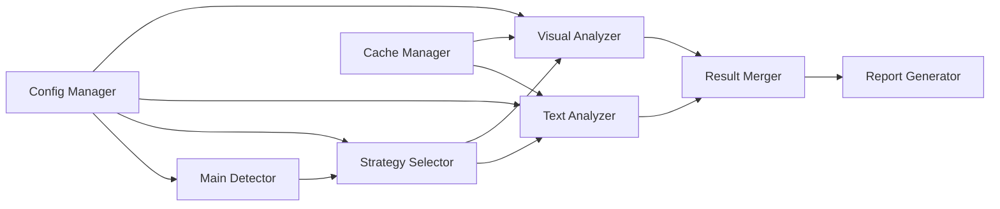

# AI向け仕様書：ハイブリッドはみ出し検出システム
## 技術仕様と実装要件

### 🔧 技術スタック要件

```yaml
python_version: ">=3.8"  # 型ヒント、walrus演算子が使用可能
required_libraries:
  - pdfplumber: ">=0.9.0"  # PDF解析
  - PyMuPDF: ">=1.23.0"   # fitz, 高速レンダリング
  - opencv-python: ">=4.8.0"  # 画像処理
  - pillow: ">=10.0.0"    # 画像変換
  - numpy: ">=1.24.0"     # 数値計算
  - pyyaml: ">=6.0"       # 設定ファイル
  - concurrent.futures: "標準ライブラリ"  # 並列処理
```

### 📐 検出精度仕様

#### はみ出し検出の分類
```python
# AIへの重要な指示: この分類は厳密に守る
OVERFLOW_CATEGORIES = {
    "micro": {
        "range_pt": (0.1, 1.0),
        "description": "ほぼ見えないが技術的には存在",
        "action": "記録のみ",
        "color": "#FFFDE7"
    },
    "minor": {
        "range_pt": (1.0, 5.0),
        "description": "視認可能だが許容範囲",
        "action": "警告",
        "color": "#FFF9C4"
    },
    "moderate": {
        "range_pt": (5.0, 20.0),
        "description": "明確に問題",
        "action": "修正推奨",
        "color": "#FFE082"
    },
    "major": {
        "range_pt": (20.0, 50.0),
        "description": "重大な問題",
        "action": "修正必須",
        "color": "#FFAB91"
    },
    "critical": {
        "range_pt": (50.0, float('inf')),
        "description": "致命的",
        "action": "即時対応",
        "color": "#EF5350"
    }
}
```

### 🏗️ アーキテクチャ仕様

#### コンポーネント間の通信


#### データフロー仕様
```python
# AIへの実装指示: このフローを厳密に実装
class DataFlow:
    """
    1. PDF入力 → ページ分割
    2. 各ページ → コードブロック検出
    3. 各コードブロック → はみ出し解析
    4. 解析結果 → 統合・検証
    5. 最終結果 → レポート生成
    """
```

### 🔍 検出アルゴリズム詳細

#### テキストベース検出
```python
def text_based_detection_spec():
    """
    AIへの実装仕様:
    
    1. 文字抽出:
       - pdfplumber.Page.chars を使用
       - 各文字の正確な位置情報 (x0, y0, x1, y1) を取得
       
    2. 行のグループ化:
       - Y座標の差が3pt以内なら同一行
       - 日本語・英語混在を考慮
       
    3. はみ出し計算:
       - 行内最右端文字のx1座標
       - コードブロックのx1座標との差
       - 0.1pt単位で記録
       
    4. 信頼度:
       - 文字情報完全: 0.95
       - 部分的: 0.7-0.9
       - 推定のみ: 0.5-0.7
    """
```

#### 視覚ベース検出
```python
def visual_based_detection_spec():
    """
    AIへの実装仕様:
    
    1. レンダリング:
       - 解像度: 300 DPI (品質優先)
       - フォーマット: RGB
       - アンチエイリアス: 有効
       
    2. 前処理:
       - グレースケール変換
       - ガウシアンブラー (kernel=3x3)
       - 適応的二値化
       
    3. エッジ検出:
       - Canny edge detection
       - low_threshold = 50
       - high_threshold = 150
       
    4. はみ出し検出:
       - 行ごとの水平投影
       - 右端エッジの位置特定
       - ピクセル→pt変換 (DPI/72)
    """
```

### 📊 パフォーマンス仕様

#### 処理時間要件
```python
PERFORMANCE_REQUIREMENTS = {
    "single_page": {
        "text_only": 0.5,      # 秒
        "visual_only": 2.0,    # 秒
        "hybrid": 2.5,         # 秒
    },
    "100_pages": {
        "sequential": 60,      # 秒
        "parallel_4": 20,      # 秒
    },
    "memory_usage": {
        "base": 200,          # MB
        "per_page": 10,       # MB
        "max_total": 2048,    # MB
    }
}
```

#### 並列処理仕様
```python
# AIへの実装指示: ProcessPoolExecutorを使用
parallel_spec = {
    "executor": "ProcessPoolExecutor",
    "max_workers": "min(4, cpu_count())",
    "chunk_strategy": "dynamic",  # ページ数に応じて動的に決定
    "timeout_handling": "skip_and_continue",
    "memory_monitoring": True
}
```

### 🗃️ データモデル仕様

#### 検出結果の構造
```python
from typing import List, Dict, Optional, Tuple
from datetime import datetime
from enum import Enum

class DetectionResult:
    """
    AIへの実装指示: 
    - すべてのフィールドは Optional にしない（必須）
    - JSON シリアライズ可能にする
    - __str__ メソッドで人間が読める形式を提供
    """
    
    file_path: str
    total_pages: int
    detection_timestamp: datetime
    detection_duration_sec: float
    
    # ページごとの結果
    page_results: Dict[int, 'PageResult']
    
    # サマリー統計
    summary: 'DetectionSummary'
    
    # メタデータ
    metadata: Dict[str, any]

class PageResult:
    """ページ単位の検出結果"""
    page_number: int
    code_blocks: List['CodeBlock']
    overflows: List['OverflowInfo']
    processing_time_sec: float
    detection_method_used: str

class OverflowInfo:
    """個別のはみ出し情報"""
    line_number: int
    line_text: str
    overflow_width_pt: float  # 小数点第1位まで
    category: str  # micro, minor, moderate, major, critical
    confidence: float  # 0.0-1.0
    detection_source: str  # text, visual, consensus
    
    # 位置情報
    bbox: Tuple[float, float, float, float]
    
    # 修正提案
    suggestions: List[str]
```

### 🔧 API仕様

#### メインクラスのインターフェース
```python
class HybridOverflowDetector:
    """
    AIへの実装指示:
    - __init__ では設定ファイルを読み込む
    - すべてのpublicメソッドにdocstringを付ける
    - 例外は内部でキャッチして結果に含める
    """
    
    def __init__(self, config_path: Optional[str] = None):
        """設定ファイルがない場合はデフォルト値を使用"""
        
    def detect_file(self, 
                   pdf_path: str, 
                   strategy: Optional[str] = None,
                   progress_callback: Optional[callable] = None
                   ) -> DetectionResult:
        """単一PDFファイルを検出"""
        
    def detect_batch(self,
                    pdf_paths: List[str],
                    parallel: bool = True,
                    max_workers: int = 4
                    ) -> List[DetectionResult]:
        """複数PDFを一括検出"""
        
    def generate_report(self,
                       result: DetectionResult,
                       format: str = "markdown",
                       output_path: Optional[str] = None
                       ) -> str:
        """検出結果のレポート生成"""
```

### 📈 レポート仕様

#### Markdownレポートフォーマット
```markdown
# コードブロックはみ出し検出レポート

## 📊 サマリー
- **ファイル**: {file_path}
- **総ページ数**: {total_pages}
- **検出時間**: {duration}秒
- **検出されたはみ出し**: {total_overflows}件

### 重要度別分布
| カテゴリ | 件数 | 割合 |
|----------|------|------|
| 微小 (< 1pt) | {micro} | {micro_pct}% |
| 軽微 (1-5pt) | {minor} | {minor_pct}% |
| 中程度 (5-20pt) | {moderate} | {moderate_pct}% |
| 重大 (20-50pt) | {major} | {major_pct}% |
| 致命的 (>50pt) | {critical} | {critical_pct}% |

## 📝 詳細

### ページ {page_num}
検出されたはみ出し: {count}件

#### コードブロック {block_num}
```
{code_preview}
```

**はみ出し検出:**
- 行{line_num}: **{overflow_width:.1f}pt** ({category})
  - 検出方法: {method}
  - 信頼度: {confidence:.0%}
  - 内容: `{line_text_preview}`

**修正提案:**
{suggestions}
```

### 💾 キャッシュ仕様

```python
# AIへの実装指示: functools.lru_cacheとカスタムキャッシュの組み合わせ
cache_spec = {
    "page_render_cache": {
        "type": "LRU",
        "max_size": 100,  # ページ数
        "ttl": None,  # プロセス終了まで
    },
    "detection_result_cache": {
        "type": "file_based",
        "directory": ".overflow_cache",
        "key_format": "{pdf_hash}_{page_num}_{strategy}",
        "ttl": 3600,  # 1時間
    }
}
```

### 🚦 エラーコードと対処

```python
ERROR_CODES = {
    "E1001": {
        "description": "PDFファイルが見つからない",
        "recovery": "空の結果を返してスキップ"
    },
    "E1002": {
        "description": "PDF解析エラー",
        "recovery": "そのページをスキップ"
    },
    "E1003": {
        "description": "メモリ不足",
        "recovery": "視覚検出を無効化"
    },
    "E1004": {
        "description": "タイムアウト",
        "recovery": "簡易モードに切り替え"
    },
    "E1005": {
        "description": "レンダリングエラー",
        "recovery": "テキストのみで検出"
    }
}
```

### 🔍 デバッグとログ

```python
# AIへの実装指示: loggingモジュールを使用
logging_config = {
    "format": "%(asctime)s - %(name)s - %(levelname)s - %(message)s",
    "level": "INFO",
    "handlers": [
        {"type": "console", "level": "INFO"},
        {"type": "file", "filename": "overflow_detection.log", "level": "DEBUG"}
    ],
    "performance_logging": True,  # 各処理の時間を記録
    "memory_logging": True,  # メモリ使用量を記録
}
```

### 🎯 品質保証要件

```python
# AIが実装時に満たすべき品質基準
quality_requirements = {
    "code_coverage": 80,  # テストカバレッジ
    "max_cyclomatic_complexity": 10,  # 関数の複雑度
    "max_function_length": 50,  # 行数
    "docstring_coverage": 100,  # すべての関数にdocstring
    "type_hint_coverage": 100,  # すべての関数に型ヒント
}
```