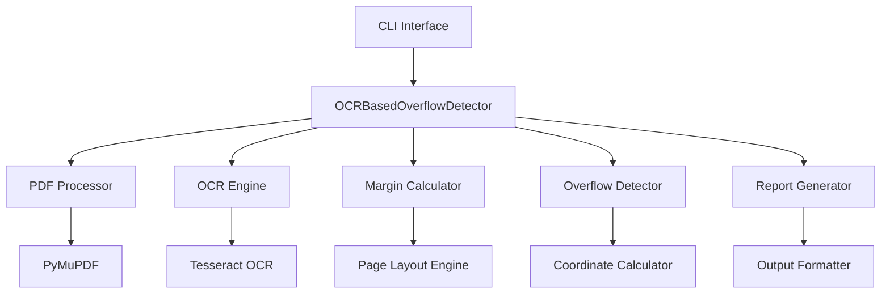
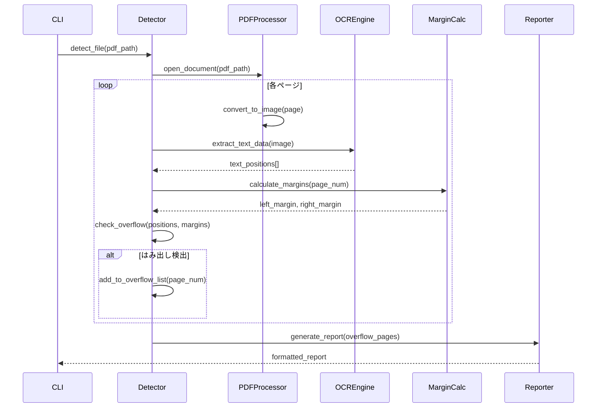

# コードブロックはみ出し検出システム 設計仕様書

## アーキテクチャ設計

### システム構成


### レイヤー構成
1. **プレゼンテーション層**: CLI インターフェース
2. **ビジネスロジック層**: 検出エンジン、マージン計算
3. **データアクセス層**: PDF読み込み、OCR処理
4. **外部サービス層**: Tesseract OCR

## クラス設計

### メインクラス: OCRBasedOverflowDetector

```python
class OCRBasedOverflowDetector:
    """OCRベースの本文幅逸脱検出メインクラス"""
    
    # 定数定義
    DPI: int = 300
    PAGE_WIDTH_MM: float = 182.0
    PAGE_HEIGHT_MM: float = 257.0
    
    # マージン設定（B5判見開き対応）
    LEFT_PAGE_LEFT_MARGIN_MM: float = 20.0
    LEFT_PAGE_RIGHT_MARGIN_MM: float = 15.0
    RIGHT_PAGE_LEFT_MARGIN_MM: float = 15.0
    RIGHT_PAGE_RIGHT_MARGIN_MM: float = 20.0
    
    def __init__(self) -> None:
        """初期化処理"""
        
    def detect_file(self, pdf_path: Path) -> List[int]:
        """PDFファイル解析のメインエントリーポイント"""
        
    def _check_text_overflow_ocr(self, image: Image.Image, 
                                is_right_page: bool, 
                                page_number: int) -> bool:
        """OCRベースのはみ出し検出"""
        
    def _calculate_margins(self, is_right_page: bool) -> Tuple[int, int]:
        """ページ種別に応じたマージン計算"""
        
    def _is_text_in_main_area(self, text_left: int, left_margin: int) -> bool:
        """テキストが本文エリア内かどうか判定"""
        
    def generate_report(self, pdf_path: Path, overflow_pages: List[int], 
                       output_path: Optional[Path] = None) -> str:
        """結果レポート生成"""
```

### 補助クラス設計

#### PageLayoutCalculator
```python
class PageLayoutCalculator:
    """ページレイアウト計算専用クラス"""
    
    @staticmethod
    def is_right_page(page_number: int) -> bool:
        """右ページ（奇数ページ）判定"""
        
    @staticmethod
    def calculate_text_area_bounds(page_width: int, page_height: int, 
                                  is_right_page: bool) -> Tuple[int, int, int, int]:
        """本文エリアの境界計算"""
```

#### OCRProcessor
```python
class OCRProcessor:
    """OCR処理専用クラス"""
    
    def __init__(self, language: str = 'jpn+eng'):
        """OCR設定初期化"""
        
    def extract_text_data(self, image: Image.Image) -> Dict:
        """テキストと位置情報の抽出"""
        
    def validate_ocr_availability(self) -> bool:
        """OCRエンジンの可用性確認"""
```

## データフロー設計

### 処理シーケンス


## データ構造設計

### OCRデータ構造
```python
@dataclass
class TextElement:
    """OCRで検出されたテキスト要素"""
    text: str
    left: int
    top: int
    width: int
    height: int
    confidence: float
    
    @property
    def right(self) -> int:
        return self.left + self.width
```

### 検出結果構造
```python
@dataclass
class OverflowResult:
    """はみ出し検出結果"""
    page_number: int
    is_right_page: bool
    overflow_amount: float
    text_sample: str
    text_position: Tuple[int, int, int, int]  # left, top, width, height
```

## アルゴリズム設計

### はみ出し判定アルゴリズム
```python
def detect_overflow(text_elements: List[TextElement], 
                   margins: Tuple[int, int]) -> List[OverflowResult]:
    """
    はみ出し検出の詳細アルゴリズム
    
    Args:
        text_elements: OCRで検出されたテキスト要素リスト
        margins: (left_margin, right_margin) のタプル
        
    Returns:
        検出されたはみ出し要素のリスト
    """
    left_margin, right_margin = margins
    text_area_right = page_width - right_margin
    overflow_threshold = 5  # ピクセル
    
    overflows = []
    
    for element in text_elements:
        # 本文エリア内のテキストのみチェック
        if element.left >= (left_margin - 10):  # 10px余裕
            # はみ出し判定
            if element.right > (text_area_right + overflow_threshold):
                overflow_amount = element.right - text_area_right
                overflows.append(OverflowResult(
                    page_number=current_page,
                    overflow_amount=overflow_amount,
                    text_sample=element.text[:50],
                    text_position=(element.left, element.top, 
                                 element.width, element.height)
                ))
    
    return overflows
```

## エラーハンドリング設計

### 例外階層
```python
class OverflowDetectorError(Exception):
    """基底例外クラス"""
    pass

class PDFProcessingError(OverflowDetectorError):
    """PDF処理関連エラー"""
    pass

class OCRProcessingError(OverflowDetectorError):
    """OCR処理関連エラー"""
    pass

class ConfigurationError(OverflowDetectorError):
    """設定関連エラー"""
    pass
```

### エラーハンドリング戦略
1. **PDF読み込みエラー**: プログラム終了、明確なメッセージ
2. **OCRエラー**: ページスキップ、ログ出力、処理継続
3. **メモリエラー**: ガベージコレクション、バッチサイズ削減
4. **設定エラー**: 初期化時チェック、早期終了

## 性能設計

### メモリ管理戦略
```python
def process_pages_batch(self, doc, batch_size: int = 10):
    """バッチ処理によるメモリ効率化"""
    total_pages = len(doc)
    
    for start_idx in range(0, total_pages, batch_size):
        end_idx = min(start_idx + batch_size, total_pages)
        batch_results = []
        
        for page_idx in range(start_idx, end_idx):
            # ページ処理
            result = self._process_single_page(doc[page_idx], page_idx)
            batch_results.append(result)
        
        # バッチ結果の統合
        self._merge_batch_results(batch_results)
        
        # メモリ解放
        del batch_results
        gc.collect()
```

### 処理最適化
1. **遅延読み込み**: 必要時のみPDFページを読み込み
2. **キャッシュ戦略**: OCR結果の一時保存
3. **並列処理**: 将来の拡張でマルチプロセス対応

## テスト設計

### テスト戦略
1. **ユニットテスト**: 各メソッドの単体テスト
2. **統合テスト**: OCRエンジンとの連携テスト
3. **システムテスト**: E2Eの動作確認
4. **性能テスト**: 処理時間・メモリ使用量測定

### テストケース設計
```python
class TestOCRBasedOverflowDetector(unittest.TestCase):
    
    def test_margin_calculation_right_page(self):
        """右ページのマージン計算テスト"""
        
    def test_margin_calculation_left_page(self):
        """左ページのマージン計算テスト"""
        
    def test_overflow_detection_positive(self):
        """はみ出し検出 - 陽性ケース"""
        
    def test_overflow_detection_negative(self):
        """はみ出し検出 - 陰性ケース"""
        
    def test_error_handling_invalid_pdf(self):
        """不正PDFファイルのエラーハンドリング"""
```

## 設定・定数設計

### 設定可能パラメータ
```python
@dataclass
class DetectorConfig:
    """検出器設定"""
    dpi: int = 300
    ocr_language: str = 'jpn+eng'
    overflow_threshold_px: int = 5
    margin_tolerance_px: int = 10
    batch_size: int = 10
    
    # ページレイアウト設定
    page_width_mm: float = 182.0
    page_height_mm: float = 257.0
    
    # マージン設定
    left_page_margins: Tuple[float, float] = (20.0, 15.0)
    right_page_margins: Tuple[float, float] = (15.0, 20.0)
```

## 品質保証設計

### コード品質チェック
1. **静的解析**: flake8, mypy, pylint
2. **フォーマット**: black, isort
3. **セキュリティ**: bandit
4. **複雑度**: radon

### 継続的品質監視
- **コードカバレッジ**: pytest-cov で80%以上維持
- **パフォーマンス**: 処理時間の回帰テスト
- **メモリリーク**: メモリ使用量の監視