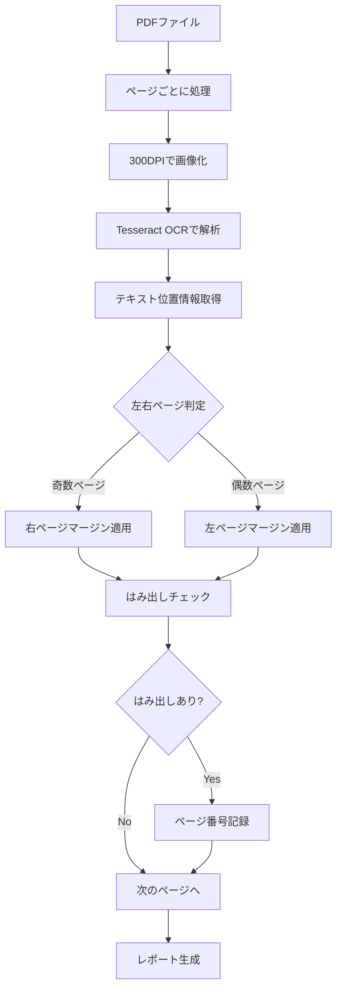

# コードブロックはみ出し検出システム 仕様書 - OCRアプローチ版

## 文書情報
- **バージョン**: 1.0.0
- **作成日**: 2025-01-28
- **アプローチ**: OCRベースのテキスト位置検出

## 1. 背景と課題

### 1.1 従来アプローチの問題点
- **灰色矩形検出**: PDFの構造によっては背景色が図形として保存されない
- **罫線検出**: 表との区別が困難、実装が複雑

### 1.2 新アプローチの採用理由
- OCRは実際に表示されるテキストの位置を正確に検出可能
- コードブロックの種類（灰色背景、罫線囲み）に依存しない
- 実装がシンプルで確実性が高い

## 2. 技術仕様

### 2.1 ページレイアウト（B5判）
```
ページサイズ: 182mm × 257mm (B5)

左ページ（偶数ページ）:
┌─────────────────────────────┐
│←20mm→│    本文エリア    │←15mm→│
│       │                 │       │
│  ノド │                 │ 小口  │
└─────────────────────────────┘

右ページ（奇数ページ）:
┌─────────────────────────────┐
│←15mm→│    本文エリア    │←20mm→│
│       │                 │       │
│  小口 │                 │  ノド │
└─────────────────────────────┘
```

### 2.2 マージン設定
| ページ種別 | 左マージン | 右マージン | 本文幅 |
|-----------|-----------|-----------|--------|
| 左ページ（偶数） | 20mm | 15mm | 147mm |
| 右ページ（奇数） | 15mm | 20mm | 147mm |

### 2.3 検出基準
- 本文エリアの右端を5px以上超えるテキストを「はみ出し」と判定
- 左マージンより左にあるテキストは無視（ページ番号等）

## 3. 実装詳細

### 3.1 処理フロー


### 3.2 OCR設定
- **エンジン**: Tesseract OCR
- **言語**: 日本語 + 英語（jpn+eng）
- **解像度**: 300 DPI
- **出力形式**: 詳細データ（位置情報付き）

### 3.3 はみ出し判定アルゴリズム
```python
def is_overflow(text_right, page_number, page_width_px):
    # ページが奇数か偶数か判定
    is_right_page = (page_number % 2 == 1)
    
    # マージンを決定
    if is_right_page:
        right_margin_mm = 20  # 右ページの右マージン
    else:
        right_margin_mm = 15  # 左ページの右マージン
    
    # 本文エリアの右端を計算
    right_margin_px = right_margin_mm * (300 / 25.4)
    text_area_right = page_width_px - right_margin_px
    
    # はみ出し判定（5pxの余裕を持たせる）
    return text_right > text_area_right + 5
```

## 4. 性能要件

### 4.1 処理速度
- 目標: 3秒/ページ以下
- 100ページのPDF: 5分以内

### 4.2 精度
- 検出率: 95%以上
- 誤検出率: 5%以下

### 4.3 システム要件
- Python 3.8以上
- Tesseract OCR 4.0以上
- メモリ: 2GB以上推奨

## 5. 利点と制限

### 5.1 利点
- コードブロックの表示形式に依存しない
- 実装がシンプルで保守しやすい
- 日本語・英語混在に対応
- 将来的な拡張が容易

### 5.2 制限事項
- OCRの精度に依存
- 処理時間が画像処理より長い
- Tesseractのインストールが必要
- 画像品質が低いPDFでは精度低下

## 6. エラーハンドリング

### 6.1 想定されるエラー
1. **Tesseract未インストール**
   - 明確なエラーメッセージとインストール方法を表示

2. **メモリ不足**
   - ページごとにメモリを解放
   - 必要に応じてガベージコレクション

3. **OCR失敗**
   - 該当ページをスキップし、エラーログに記録
   - 処理は継続

## 7. 今後の拡張案

### 7.1 短期的改善
- マルチスレッド処理
- プログレスバーの追加
- 詳細なデバッグモード

### 7.2 長期的拡張
- 機械学習によるコードブロック認識
- 複数のOCRエンジン対応
- Webインターフェース
- バッチ処理対応