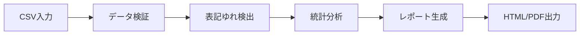
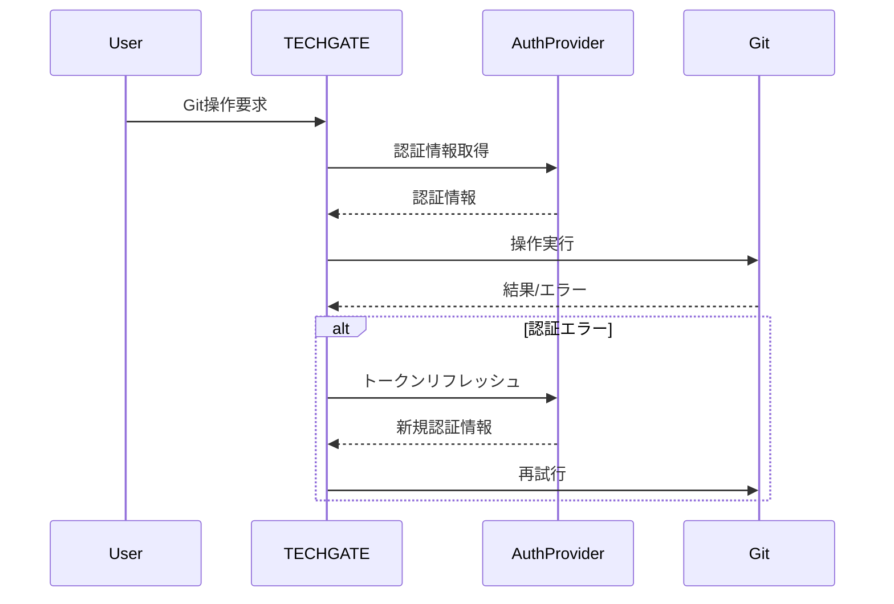

# システム設計書

## 1. システムアーキテクチャ

### 1.1 全体構成
```
┌──────────────────────────────────────────────────────┐
│                    TECHGATE                          │
│  ┌─────────────┬──────────────┬─────────────────┐  │
│  │ TechBook27  │ ProjectInit  │  Future Apps    │  │
│  │  Analyzer   │              │                 │  │
│  └──────┬──────┴──────┬───────┴────────┬────────┘  │
│         │             │                 │           │
│  ┌──────┴─────────────┴─────────────────┴────────┐  │
│  │              共通基盤層                        │  │
│  │  ・認証管理  ・Git操作  ・エラーハンドリング  │  │
│  └───────────────────────────────────────────────┘  │
└──────────────────────────────────────────────────────┘
```

### 1.2 コンポーネント設計

#### 1.2.1 TECHGATE（統合ランチャー）
- **責務**: アプリケーション統合管理、共通UI提供
- **主要機能**:
  - アプリケーション一覧表示
  - 共通設定管理（Git認証情報等）
  - バージョン管理
  - エラーログ集約

#### 1.2.2 TechBook27 Analyzer
- **責務**: 技術書サークル分析・レポート生成
- **入力**: CSVファイル（イベント出展者データ）
- **出力**: 分析レポート（HTML/PDF）
- **特徴**: 
  - サークル名の表記ゆれ検出
  - 継続出展分析
  - 統計グラフ生成

#### 1.2.3 共通基盤層
- **Git操作モジュール**:
  ```python
  class GitManager:
      def __init__(self, auth_provider: AuthProvider):
          self.auth = auth_provider
      
      def push_with_retry(self, repo_path: str, max_retries: int = 3):
          """認証エラー時の再試行機能付きpush"""
          pass
  ```

- **認証管理**:
  ```python
  class AuthProvider:
      def get_git_credentials(self) -> GitCredentials:
          """Git認証情報の取得（キャッシュ機能付き）"""
          pass
      
      def refresh_token(self):
          """トークンリフレッシュ"""
          pass
  ```

## 2. データフロー設計

### 2.1 TechBook27処理フロー


### 2.2 認証フロー


## 3. エラーハンドリング設計

### 3.1 エラー分類と対処
| エラー種別 | 対処方法 | ユーザー通知 |
|-----------|---------|-------------|
| Git認証エラー | 自動リトライ→手動認証 | ダイアログ表示 |
| CSV形式エラー | 検証結果表示 | エラー詳細表示 |
| ネットワークエラー | 指数バックオフ再試行 | プログレスバー |
| ファイルアクセスエラー | 権限確認→エラー表示 | 対処方法提示 |

### 3.2 エラーログ管理
```python
class ErrorLogger:
    def __init__(self, log_dir: Path):
        self.log_dir = log_dir
        self.setup_rotating_logs()
    
    def log_error(self, error: Exception, context: dict):
        """構造化エラーログ記録"""
        pass
```

## 4. UI/UX設計

### 4.1 TECHGATE メインウィンドウ
```
┌─────────────────────────────────────┐
│ TECHGATE v1.0                    [X]│
├─────────────────────────────────────┤
│ ┌─────────────┐ ┌─────────────┐   │
│ │ TechBook27  │ │ProjectInit  │   │
│ │  Analyzer   │ │             │   │
│ │   [起動]    │ │   [起動]    │   │
│ └─────────────┘ └─────────────┘   │
│                                     │
│ [設定] [ログ] [ヘルプ] [終了]      │
└─────────────────────────────────────┘
```

### 4.2 TechBook27 Analyzer UI
```
┌─────────────────────────────────────┐
│ TechBook27 Analyzer              [X]│
├─────────────────────────────────────┤
│ CSVファイル: [選択...]              │
│                                     │
│ 分析オプション:                     │
│ ☑ 表記ゆれ検出                     │
│ ☑ 継続出展分析                     │
│ ☑ 統計グラフ生成                   │
│                                     │
│ 出力形式: ○HTML ○PDF               │
│                                     │
│ [分析開始] [キャンセル]             │
└─────────────────────────────────────┘
```

## 5. セキュリティ設計

### 5.1 認証情報管理
- Git認証情報は暗号化してローカル保存
- Windows Credential Managerとの連携
- セッション管理（タイムアウト機能）

### 5.2 入力検証
- CSVファイルのサイズ制限（100MB）
- インジェクション対策（SQLite使用時）
- パス・トラバーサル対策

## 6. 性能設計

### 6.1 性能目標
- CSV処理: 10,000行を10秒以内
- レポート生成: 5秒以内
- 起動時間: 3秒以内

### 6.2 最適化戦略
- 大規模CSVの分割処理
- マルチスレッド化（UI応答性維持）
- メモリ効率的なストリーミング処理

## 7. 拡張性設計

### 7.1 プラグインアーキテクチャ
```python
class AppPlugin(ABC):
    @abstractmethod
    def get_name(self) -> str:
        pass
    
    @abstractmethod
    def get_icon(self) -> Path:
        pass
    
    @abstractmethod
    def launch(self, parent_window):
        pass
```

### 7.2 将来の拡張ポイント
- 新規分析アプリケーションの追加
- 外部サービス連携（GitHub API等）
- レポートテンプレートのカスタマイズ

## 8. テスト設計

### 8.1 単体テスト
- 各モジュールの個別テスト
- モックを使用したGit操作テスト
- エラーケーステスト

### 8.2 統合テスト
- エンドツーエンドシナリオテスト
- 認証フロー全体のテスト
- 大規模データ処理テスト

### 8.3 受け入れテスト
- 実際のCSVデータでの動作確認
- ユーザビリティテスト
- パフォーマンステスト