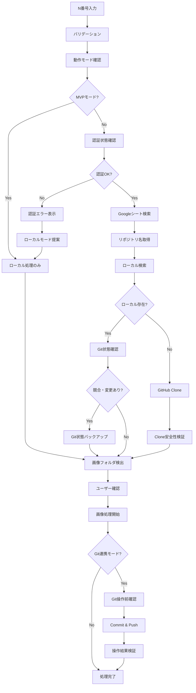
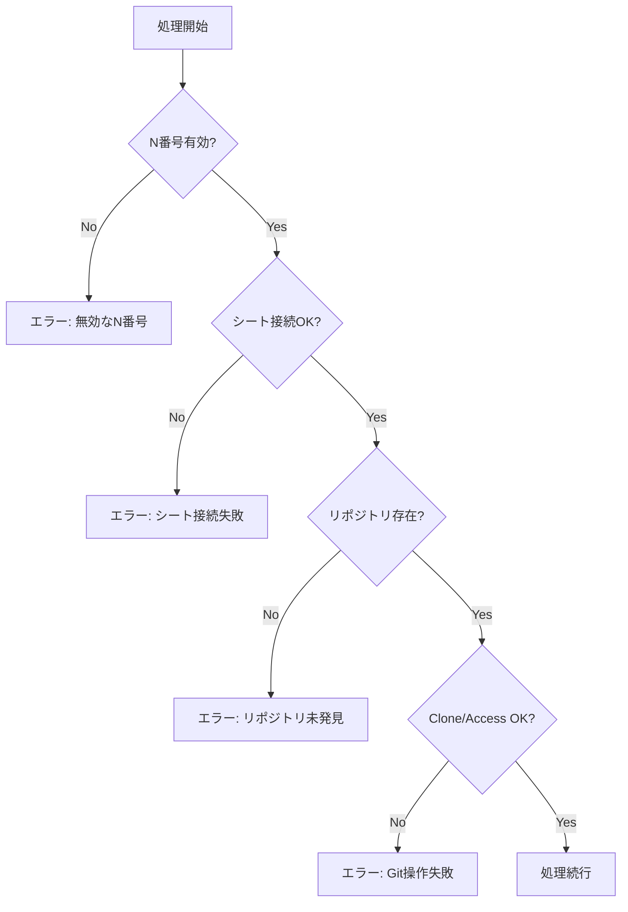

# TechImgFile v0.5 実装仕様書

**プロジェクト**: TECHZIP統合アプリ  
**作成日**: 2025-08-01  
**バージョン**: 0.5  
**UI**: Qt6  
**プラットフォーム**: Windows (EXE化対応)  

## 1. プロジェクト概要

### 1.1 目的
既存の画像処理アプリケーション（techbook27.py）をTECHZIPプロジェクトに統合し、N番号指定によるGitHub連携機能を追加した高機能画像処理ツールとして再実装する。

### 1.2 主要変更点
- **UI**: CustomTkinter → Qt6への移行
- **Git連携**: N番号からリポジトリ名取得 → GitHub clone → 画像処理の自動化
- **アーキテクチャ**: モジュラー設計によるメンテナンス性向上
- **統合**: TECHGATEからの起動対応

## 2. システム要件

### 2.1 機能要件

#### 2.1.1 メイン機能：N番号ベース画像処理ワークフロー
1. **N番号入力**
   - ユーザーがN番号（例：N02279）を入力
   - バリデーション機能付き

2. **リポジトリ名取得**
   - Google Sheets連携
   - N番号 → リポジトリ名のマッピング取得
   - TECHZIP既存のGoogleシート設定を流用

3. **Gitリポジトリ検索・取得**
   - **優先順位1**: ローカルの既存Gitフォルダ探索
   - **優先順位2**: GitHubからのclone実行
   - **対象リポジトリ**: `irdtechbook/{repository_name}`
   - **Clone先**: 設定可能なローカルディレクトリ

4. **画像フォルダ自動検出**
   - リポジトリ内の画像フォルダを自動検出
   - 一般的なパターン：`images/`, `img/`, `assets/images/` など

5. **ユーザー確認**
   - 検出されたフォルダをユーザーに確認
   - 「今後はこのフォルダを自動処理する」オプション提供

6. **画像処理実行**
   - 既存のtechbook27.pyと同等の画像処理機能
   - バッチ処理対応

7. **Git連携完了処理**
   - 変更をcommit
   - GitHubにpush
   - 処理結果のレポート生成

#### 2.1.2 サブ機能：Word先頭行削除
- 既存機能をそのまま移植
- Zipファイル内のWordファイル1行目削除
- TECHZIP既存機能との重複回避

### 2.2 非機能要件

#### 2.2.1 性能要件
- 大量画像処理への対応（1000ファイル以上）
- メモリ効率的な処理（ストリーミング処理）
- プログレスバーによる進捗表示

#### 2.2.2 運用要件
- Windows EXE化標準形式準拠
- TECHGATEからの起動対応
- 設定ファイルによる動作カスタマイズ
- ログ出力機能

## 3. システム設計

### 3.1 アーキテクチャ概要

```
TechImgFile v0.5
├── main.py (エントリーポイント)
├── ui/
│   ├── main_window.py (メインUI - Qt6)
│   ├── progress_dialog.py (進捗表示)
│   └── settings_dialog.py (設定画面)
├── core/
│   ├── n_code_processor.py (N番号処理)
│   ├── repository_manager.py (Git連携)
│   ├── image_processor.py (画像処理エンジン)
│   └── workflow_manager.py (ワークフロー制御)
├── integrations/
│   ├── google_sheets.py (Googleシート連携)
│   └── github_client.py (GitHub API)
├── utils/
│   ├── config.py (設定管理)
│   ├── logger.py (ログ管理)
│   └── validators.py (バリデーション)
└── config/
    └── settings.json (設定ファイル)
```

### 3.2 主要コンポーネント

#### 3.2.1 N番号処理エンジン (`NCodeProcessor`)
```python
class NCodeProcessor:
    def validate_n_code(self, n_code: str) -> bool
    def get_repository_name(self, n_code: str) -> str
    def get_processing_options(self, n_code: str) -> Dict
```

#### 3.2.2 リポジトリ管理 (`RepositoryManager`)
```python
class RepositoryManager:
    def find_local_repository(self, repo_name: str) -> Optional[Path]
    def clone_repository(self, repo_name: str, target_dir: Path) -> Path
    def find_image_folders(self, repo_path: Path) -> List[Path]
    def commit_and_push(self, repo_path: Path, message: str) -> bool
```

#### 3.2.3 画像処理エンジン (`ImageProcessor`)
```python
class ImageProcessor:
    def process_folder(self, folder_path: Path, options: ProcessingOptions) -> ProcessingResult
    def process_single_image(self, image_path: Path, options: ProcessingOptions) -> bool
    def create_backup(self, image_path: Path) -> Path
```

#### 3.2.4 ワークフロー管理 (`WorkflowManager`)
```python
class WorkflowManager:
    def execute_n_code_workflow(self, n_code: str) -> WorkflowResult
    def execute_folder_workflow(self, folder_path: Path) -> WorkflowResult
```

## 4. ユーザーインターフェース設計

### 4.1 メインウィンドウ構成

```
┌─ TechImgFile v0.5 ─────────────────────────────────────┐
│ [File] [Tools] [Auth] [Settings] [Help]               │
├───────────────────────────────────────────────────────┤
│ ┌─ 動作モード選択 ───────────────┐ ┌─ 認証状態 ────┐   │
│ │ ○ ローカルのみ（MVP）         │ │ GitHub: 🔴    │   │
│ │ ○ Git連携（フル機能）         │ │ Google: 🟡    │   │
│ └────────────────────────────────┘ └───────────────┘   │
│                                                       │
│ ┌─ N番号ベース処理 ──────────────┐ ┌─ 処理ログ ────┐   │
│ │ N番号: [N02279        ] [実行] │ │ [12:34] 開始  │   │
│ │                                │ │ [12:35] 完了  │   │
│ │ □ 自動commit&push             │ │ ...           │   │
│ │ □ バックアップ作成             │ │               │   │
│ │ □ Git操作前確認ダイアログ     │ │               │   │
│ └────────────────────────────────┘ └───────────────┘   │
│                                                       │
│ ┌─ フォルダ処理 ─────────────────┐ ┌─ 処理状況 ────┐   │
│ │ フォルダ: [参照...         ]   │ │ ■■■■□□ 67%  │   │
│ │                                │ │ 123/185 完了  │   │
│ │ [画像処理開始]                 │ │               │   │
│ └────────────────────────────────┘ └───────────────┘   │
│                                                       │
│ ┌─ 処理オプション ───────────────┐                     │
│ │ □ プロファイル除去            │                     │
│ │ □ グレースケール変換          │                     │
│ │ □ リサイズ (400万画素)        │                     │
│ │ □ PNG→JPG変換                │                     │
│ └────────────────────────────────┘                     │
└───────────────────────────────────────────────────────┘
```

### 4.2 認証管理ダイアログ（新規）

```
┌─ 認証管理 ─────────────────────────────────────┐
│ ┌─ GitHub認証 ───────────────────────────────┐ │
│ │ ○ Personal Access Token                  │ │
│ │   Token: [******************] [更新]     │ │
│ │ ○ OAuth2フロー [認証開始]                │ │
│ │ 状態: 🟢 接続済み (expires: 2025-09-01)  │ │
│ │ [テスト接続] [トークン削除]               │ │
│ └────────────────────────────────────────────┘ │
│                                                │
│ ┌─ Google認証 ───────────────────────────────┐ │
│ │ Service Account: [credentials.json] [参照] │ │
│ │ 状態: 🟡 制限あり (100req/day)            │ │
│ │ [認証テスト] [認証ファイル更新]           │ │
│ └────────────────────────────────────────────┘ │
│                                                │
│ ┌─ セキュリティ設定 ─────────────────────────┐ │
│ │ □ Windows Credential Manager使用         │ │
│ │ □ トークン自動ローテーション              │ │
│ │ □ 認証失敗時の自動リトライ                │ │
│ └────────────────────────────────────────────┘ │
│                                                │
│ [保存] [キャンセル] [セキュリティテスト実行]   │
└────────────────────────────────────────────────┘
```

### 4.3 設定ダイアログ（修正版）

```
┌─ 設定 ─────────────────────────────────────────┐
│ ┌─ Git設定 ──────────────────────────────────┐ │
│ │ Clone先: [C:\Git\Repositories    ] [参照] │ │
│ │ ユーザー名: [irdtechbook]                 │ │
│ │ □ Git操作前に確認ダイアログを表示         │ │
│ │ □ 操作履歴をバックアップ                  │ │
│ │ 安全性レベル: [高] [中] [低]              │ │
│ └────────────────────────────────────────────┘ │
│                                                │
│ ┌─ Google Sheets設定 ────────────────────────┐ │
│ │ シートID: [17DKsMGQ6krbhY7GIcX0ia...]     │ │
│ │ キャッシュ保持時間: [60] 分               │ │
│ │ □ オフライン時はキャッシュ使用            │ │
│ └────────────────────────────────────────────┘ │
│                                                │
│ ┌─ 画像処理設定 ─────────────────────────────┐ │
│ │ デフォルト解像度: [100] DPI               │ │
│ │ 最大画素数: [400] 万画素                  │ │
│ │ メモリ制限: [2048] MB                     │ │
│ │ □ バックアップを自動作成                  │ │
│ │ □ 大量処理時の一時停止機能                │ │
│ └────────────────────────────────────────────┘ │
│                                                │
│ [OK] [キャンセル] [適用] [認証管理]            │
└────────────────────────────────────────────────┘
```

## 5. データフロー

### 5.1 N番号ベース処理フロー（修正版）



### 5.2 エラーハンドリング



## 6. 設定ファイル仕様

### 6.1 settings.json（修正版）
```json
{
    "app": {
        "name": "TechImgFile",
        "version": "0.5",
        "log_level": "INFO",
        "operation_mode": "mvp",
        "enable_git_integration": false
    },
    "authentication": {
        "use_credential_manager": true,
        "auto_token_rotation": false,
        "auth_retry_attempts": 3,
        "auth_timeout_seconds": 30
    },
    "git": {
        "clone_base_path": "C:\\Git\\Repositories",
        "default_user": "irdtechbook",
        "auto_commit": false,
        "auto_push": false,
        "confirm_before_operations": true,
        "backup_before_operations": true,
        "safety_level": "high",
        "use_dulwich": true,
        "operation_timeout_seconds": 300
    },
    "google_sheets": {
        "sheet_id": "17DKsMGQ6krbhY7GIcX0iaeN-y8HcGGVkXt3d4oOckyQ",
        "credentials_path": "config/credentials.json",
        "n_code_column": "A",
        "repo_name_column": "B",
        "cache_duration_minutes": 60,
        "use_cache_offline": true,
        "request_rate_limit": 100
    },
    "image_processing": {
        "default_resolution": 100,
        "max_pixels_mp": 400,
        "memory_limit_mb": 2048,
        "create_backup": true,
        "backup_folder_name": "backup",
        "supported_formats": [".jpg", ".jpeg", ".png"],
        "png_to_jpg": true,
        "remove_profile": false,
        "grayscale": false,
        "batch_pause_enabled": true,
        "max_concurrent_processes": 2
    },
    "ui": {
        "theme": "system",
        "window_size": [900, 700],
        "auto_detect_folders": true,
        "confirm_operations": true,
        "show_auth_status": true,
        "show_mode_selector": true
    },
    "security": {
        "log_sensitive_data": false,
        "encrypt_local_storage": true,
        "secure_memory_cleanup": true,
        "audit_log_enabled": true
    }
}
```

## 7. Git連携詳細仕様

### 7.1 リポジトリ検索ロジック
1. **ローカル検索**
   ```
   検索パス：
   - {clone_base_path}/{repo_name}
   - {clone_base_path}/irdtechbook/{repo_name}
   - G:\マイドライブ\[git]\{repo_name} (TECHZIPとの互換性)
   ```

2. **GitHub Clone**
   ```
   URL形式: https://github.com/irdtechbook/{repo_name}.git
   Clone先: {clone_base_path}/{repo_name}
   認証: GitHub Token使用
   ```

### 7.2 画像フォルダ検出パターン
```python
DETECTION_PATTERNS = [
    "images/**",
    "img/**", 
    "assets/images/**",
    "src/images/**",
    "static/images/**",
    "resources/images/**",
    "**/images/**"
]
```

### 7.3 Commit & Push仕様
```python
def commit_and_push(self, repo_path: Path, message: str = None):
    # デフォルトメッセージ
    if not message:
        message = f"画像処理完了 - TechImgFile v0.5 ({datetime.now()})"
    
    # Git操作
    subprocess.run(["git", "add", "."], cwd=repo_path)
    subprocess.run(["git", "commit", "-m", message], cwd=repo_path)
    subprocess.run(["git", "push"], cwd=repo_path)
```

## 8. Windows EXE化仕様

### 8.1 ビルド設定
- **ファイル名**: `TechImgFile.0.5.exe`
- **アイコン**: `resources/techimgfile_icon.ico`
- **ビルドスクリプト**: `TechImgFile.build.ps1`
- **配置先**: `dist/`

### 8.2 ビルドスクリプト仕様
```powershell
# TechImgFile.build.ps1
param(
    [string]$Version = "0.5"
)

# 前バージョン保持
if (Test-Path "dist/TechImgFile.$Version.exe") {
    $timestamp = Get-Date -Format "yyyyMMdd_HHmmss"
    Move-Item "dist/TechImgFile.$Version.exe" "dist/TechImgFile.$Version.backup_$timestamp.exe"
}

# PyInstaller実行
pyinstaller --onefile --windowed --icon=resources/techimgfile_icon.ico --name="TechImgFile.$Version" main.py

# distフォルダに配置
Copy-Item "dist/TechImgFile.$Version.exe" "dist/"

Write-Host "ビルド完了: dist/TechImgFile.$Version.exe"
```

## 9. TECHGATE統合仕様

### 9.1 起動パラメータ
```python
# TECHGATEからの起動検出
if len(sys.argv) > 1 and sys.argv[1] == "--from-techgate":
    # TECHGATE連携モードで起動
    app.setApplicationName("TechImgFile (via TECHGATE)")
```

### 9.2 バージョン検出対応
TechGate.pyでの検出パターンに対応：
```python
# TechGate.pyに追加する検出パターン
"techimgfile": {
    "folder_pattern": r"TechImgFile\.(\d+\.\d+)",
    "exe_pattern": r"TechImgFile\.(\d+\.\d+)\.exe"
}
```

## 10. テスト仕様

### 10.1 単体テスト
- N番号バリデーション
- Google Sheets接続
- Git操作（Mock使用）
- 画像処理ロジック

### 10.2 統合テスト
- N番号 → リポジトリ取得 → 画像処理の完全フロー
- エラーハンドリング
- UI操作

### 10.3 EXE化テスト
- 依存関係の確認
- 設定ファイル読み込み
- パフォーマンス測定

## 11. 実装優先順位（修正版 - ST検証対応）

### Phase 0: リスク軽減設計 (2-3時間)【新規追加】
1. 認証アーキテクチャ設計
   - Windows Credential Manager統合設計
   - OAuth2フロー設計
   - トークン管理セキュリティ設計
2. Git操作安全性設計
   - dulwich採用可否検討
   - バックアップ戦略設計
   - 操作前確認フロー設計
3. MVP/フル機能モード切り替え設計
   - 段階的展開戦略
   - 機能境界線の明確化

### Phase 1: 基盤実装 (4-5時間)
1. プロジェクト構造作成
2. Qt6 UI基盤構築（MVP/フル切り替え対応）
3. 設定管理システム（セキュリティ対応）
4. ログシステム（監査ログ対応）
5. 認証管理基盤（Windows Credential Manager統合）

### Phase 2: コア機能 (8-10時間)
1. N番号処理エンジン
2. Google Sheets連携（セキュリティ強化）
3. Git連携（既存フォルダ検索 + 安全性確認）
4. 画像処理エンジン移植
5. 認証管理ダイアログ実装

### Phase 3: Git拡張 (6-8時間)【工数増加】
1. 安全なGitHub Clone機能（dulwich検討）
2. バックアップ付きCommit & Push機能
3. Git操作前確認システム
4. エラーハンドリング強化
5. 操作履歴・監査機能

### Phase 4: 統合・最適化 (5-7時間)【工数増加】
1. MVP↔フル機能モード統合
2. セキュリティテスト実行
3. TECHGATE統合
4. Windows EXE化
5. パフォーマンス最適化

**総工数見積もり**: 35-40時間（従来20-25時間から大幅増加）

## 12. リスクと対策（ST検証に基づく修正版）

### 12.1 Critical技術リスク（ST検証で特定）
- **認証セキュリティリスク**: 
  - **問題**: トークン平文保存、認証フロー脆弱性
  - **対策**: Windows Credential Manager必須採用、OAuth2フロー実装
  - **バックアップ**: ローカルMVPモードへのフォールバック

- **Git操作安全性リスク**:
  - **問題**: 直接git操作によるリポジトリ破損リスク
  - **対策**: dulwich採用検討、操作前バックアップ、確認ダイアログ必須
  - **バックアップ**: 操作履歴とロールバック機能

- **段階的展開リスク**:
  - **問題**: 一度にフル機能実装は失敗リスク高
  - **対策**: MVP（ローカルのみ）→フル機能の段階展開
  - **バックアップ**: いつでもMVPモードに戻れる設計

### 12.2 工数・スケジュールリスク（ST検証で再評価）
- **従来見積もりの40-60%不足**:
  - **原因**: 認証管理、Git安全性、段階的実装の複雑性を過小評価
  - **対策**: 35-40時間への見積もり修正、Phase 0追加
  - **バックアップ**: 機能削減によるスコープ調整

- **認証実装の学習コスト**:
  - **問題**: Windows Credential Manager、OAuth2の実装経験不足
  - **対策**: 事前調査時間確保、既存ライブラリ活用
  - **バックアップ**: 段階的認証実装（Token→OAuth2）

### 12.3 運用リスク
- **設定ファイル管理**: デフォルト設定の提供、セキュリティ設定の適切な初期値
- **エラー回復**: 中間状態からの復旧機能、Git操作の安全なロールバック
- **互換性**: 既存TECHZIPとの設定共有、認証情報の安全な移行

この仕様書に基づいて、TechImgFile v0.5の実装を進めることで、既存機能を保持しながらGit連携による高度な自動化を実現します。